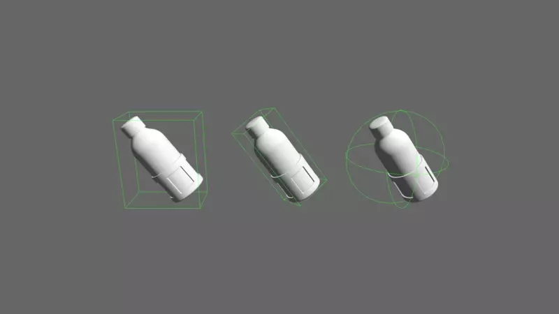

# Bounding Box Generation for Bevy

Unofficial plugin for generating bounding boxes.



## Status

| Status | Bounding Volume |
|:-:|----------------------------|
| ✅ | Bounding Sphere            |
| ✅ | Axis Aligned Bounding Box  |
| ✅ | Oriented Bounding Box      |
| ❌ | Convex Hull                |

## Demo

Run the demo with:

```shell
cargo run --example demo --features="ex"
```